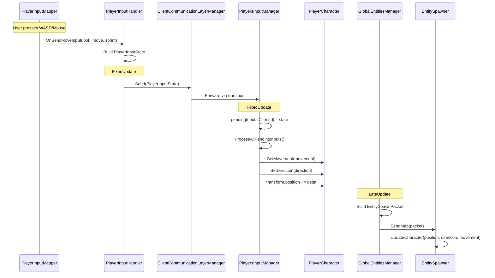
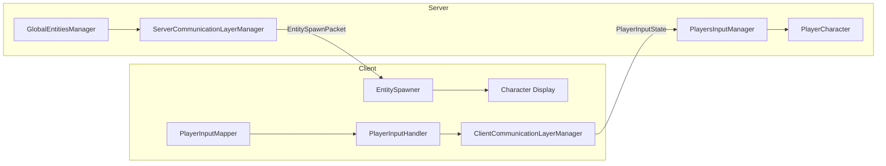

# Character Movement

- **Status:** Implemented (movement + input integration, client/server split)
- **Summary:** Player movement and input-handling logic have been implemented with a clear client/server separation. Input is collected on the client, sent to the server for processing, and reconciled back on the client.

## Input Flow Diagram

## Architecture

### Client-side (PlayerInputHandler)
- Captures raw input from `PlayerInputMapper` (look, move, sprint, interact).
- Builds a `PlayerInputState` packet each tick.
- Sends `PlayerInputState` to the server via `ClientCommunicationLayerManager`.
- Does NOT mutate entity state directly; all entity updates come from the server.

### Client-side (EntitySpawner)
- Receives `EntitySpawnPacket` from server containing entity positions, directions, and movement states.
- Spawns new entities and updates existing ones.
- This is the authoritative source of entity state on the client.

### Server-side (PlayersInputManager)
- Receives `PlayerInputState` packets from clients via `ServerPacketHandler`.
- Stores pending inputs per client in a dictionary (keyed by `ClientId`).
- Processes all pending inputs once per `FixedUpdate` cycle (handles multiple inputs arriving between ticks by keeping only the latest).
- Applies movement and interaction logic on the server, mutating entity state.

### Server-side (GlobalEntitiesManager)
- Broadcasts `EntitySpawnPacket` per map containing all entity states.
- Clients receive this packet via `EntitySpawner` to update their local view.

### Shared utilities
- `DirectionEnumHelper`: static helper for Vector2 to `DirectionEnum` conversion, used by server-side input processing.

## Release notes

- Implemented player movement driven by mapped input, with initial player input handling and movement logic in place.
- Added `PlayerCharacter` abstraction to encapsulate movement application and state.
- Movement updates are synchronized to the server tick to avoid multiple updates per tick and reduce redundant network messages.
- Refactored `PlayerInputHandler` to focus on client responsibilities (building/sending input only - no entity mutation).
- Implemented `PlayersInputManager` for server-side input aggregation and processing.
- Entity state is broadcast via `EntitySpawnPacket` from `GlobalEntitiesManager` and applied by `EntitySpawner` on the client.
- Added `DirectionEnumHelper` for shared direction conversion logic.
- The sample scene was updated to showcase movement and animation integration.

Developer notes / TODOs found in code

- `PlayerInputHandler` contains TODOs indicating planned refactors:
  - Extract `PlayerInputState` into a separate file.
  - Replace hardcoded movement speed with a configurable character attribute.
- Consider documenting the server tick synchronization strategy so other contributors can follow the same pattern.

Suggested next steps

- Extract input mapping and add support for multiple input devices (keyboard/gamepad).
- Expose movement parameters (speed, acceleration) on character data/components.
- Add editor or automated tests to validate server tick sync behavior.
- Move `PlayerInputState` class to its own file under a common packets directory.

