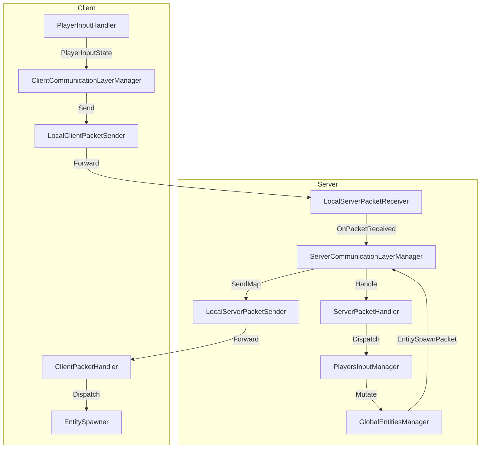
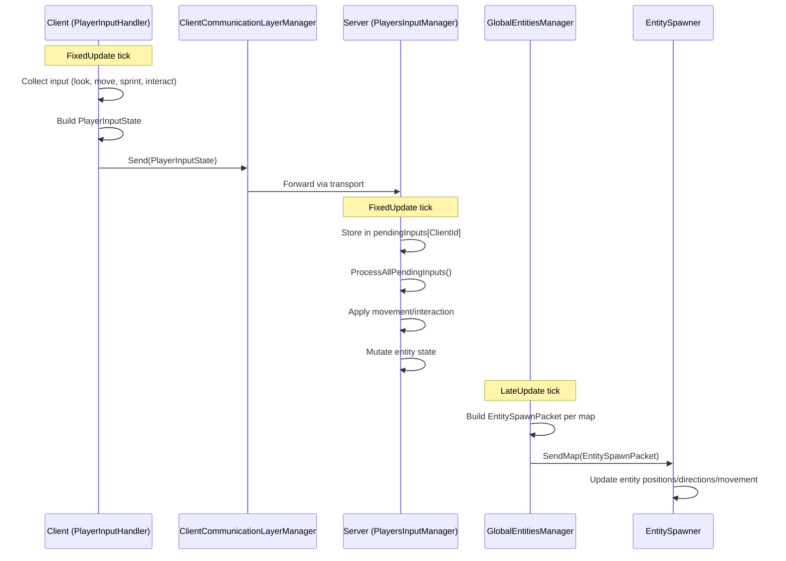

# Multiplayer Architecture and Flow

## Overview
This document summarizes the current multiplayer architecture, packet flow, and runtime utilities. It focuses on the client/server handler restructure and observer support.

## Architecture Diagram

## Core packet handling
- `AvalonPacketHandler`: base MonoBehaviour that maps packet types to handlers (`RegisterHandler`, `UnregisterHandler`, `Handle`).
- `ClientPacketHandler` / `ServerPacketHandler`: thin wrappers over `AvalonPacketHandler` providing client/server registration helpers.
- Packets share a common base `AvalonPacket` (not documented here) and use a `ClientId` to scope delivery.

### Communication layers
- **ServerCommunicationLayerManager**
  - Finds implementations of `IAvalonPacketServerSender` and `IAvalonPacketServerReceiver` (currently local-loopback versions).
  - Registers `OnPacketReceived` to route incoming packets into the `ServerPacketHandler`.
  - Provides `Send(packet)` for broadcast and `Send(packet, recipients)` for scoped delivery (used by observers and map filtering).
  - Maintains observer filters per packet type so only relevant observers receive packets.
- **ClientCommunicationLayerManager**
  - Finds `IAvalonClientPacketSender` and the `ClientPacketHandler`.
  - Exposes `Send(packet)` to push client packets to the server and `Handle(packet)` to dispatch server responses to registered client handlers.

### Local loopback transport (play-in-editor)
- `LocalClientPacketSender`: client-side sender that forwards packets directly into `LocalServerPacketReceiver`.
- `LocalServerPacketReceiver`: server-side receiver that stamps missing `ClientId` with the local player id and emits `OnPacketReceived`.
- `LocalServerPacketSender`: server-side sender that forwards packets back to the local client or observer instances when their ids are in the recipient list.

## Connection and observer flow
- **MultiplayerConnectionManager**
  - Registers server handlers for `ConnectPlayerPacket`, `ConnectObserverPacket`, and `ObserveMapPacket`.
  - `OnConnectPlayer`: forwards connection requests into `GlobalEntitiesManager` for player setup.
  - `OnObserverConnect`: issues an observer id if missing, caches observer data, and sends a `ConnectObserverPacket` response to the client.
  - `ObserveMap`: tracks which map each observer watches and registers observer filters so only packets for that map are forwarded.
- **GlobalEntitiesManager**
  - Maintains a global registry of entities, subscribes to spawn/despawn events, and instantiates players on connect.
  - In `LateUpdate`, builds a per-map snapshot of players/enemies and sends an `EntitySpawnPacket` via `ServerCommunicationLayerManager.SendMap` so only players/observers on that map receive the update.
- **ObserverCommandInput**
  - UI/command helper for observers. Supports `list maps` and `move {mapId|index}` commands by sending `ObserveMapPacket` with the current observer id.
- **ClientTestSend**
  - Editor utility to create a local player (`Alt+P`) or observer (`Alt+O`). Handles observer connection handshake, sends the initial map subscription, and spawns prefabs for local testing.

## Player input flow

- **PlayerInputHandler (client)**
  - Collects look/move/sprint/interact input into a `PlayerInputState` packet.
  - Sends `PlayerInputState` via `ClientCommunicationLayerManager` each fixed tick.
  - Does NOT mutate entity state directly; entity updates come from `EntitySpawnPacket`.
- **PlayersInputManager (server)**
  - Receives `PlayerInputState` packets from clients via `ServerPacketHandler`.
  - Stores pending inputs in a dictionary keyed by `ClientId`, ensuring only the latest input per player is processed per cycle (handles multiple inputs arriving between ticks).
  - Processes all pending inputs once per `FixedUpdate` cycle.
  - Applies movement and interaction logic on the server, mutating entity state.
  - Entity state is broadcast to clients via `EntitySpawnPacket` from `GlobalEntitiesManager`.
- **EntitySpawner (client)**
  - Receives `EntitySpawnPacket` from server.
  - Spawns new entities and updates existing entity positions, directions, and movement states.
  - This is the authoritative source of entity state on the client.

## Map-scoped packet delivery
- `ServerCommunicationLayerManager.RegisterObserver<T>` stores predicates per packet type to decide which observers should receive a packet.
- `SendMap(packet, mapId)` automatically targets players on the given map and any observers whose predicates match the packet.

## Map data updates
- `MapDataSpawner` (client) listens for `MapDataSpawnPacket` via `ClientPacketHandler` and will apply incoming map data (hook to `MapDataManager` when ready).
- `ChangeObserverMap` packet is defined but not yet used; map changes for observers currently rely on `ObserveMapPacket`.

## Usage
1. Add `ServerCommunicationLayerManager`, `ServerPacketHandler`, `LocalServerPacketReceiver`, and `LocalServerPacketSender` to the server scene (or equivalents for remote transport).
2. Add `ClientCommunicationLayerManager`, `ClientPacketHandler`, and `LocalClientPacketSender` to the client scene.
3. Connect a player:
   - Send `ConnectPlayerPacket` (e.g., via `ClientTestSend` Alt+P). The server will register the player through `GlobalEntitiesManager`.
4. Connect an observer:
   - Send `ConnectObserverPacket` (Alt+O in `ClientTestSend`). On response, send `ObserveMapPacket` with the target map id. Use `ObserverCommandInput` to change maps at runtime.
5. Register gameplay packet handlers on client/server via `RegisterClientHandler<T>` or `RegisterServerHandler<T>` as needed.

## Unstaged / Recent runtime changes
- Added client/server packet handler wrappers, communication layer managers, and local loopback sender/receiver implementations.
- Added observer connection and map subscription flow with packet filtering per map.
- Added utilities for testing connections (`ClientTestSend`) and observer commands (`ObserverCommandInput`).
- Refactored player input handling into client/server responsibilities:
  - `PlayerInputHandler` (client): builds and sends `PlayerInputState`, does NOT mutate entity state.
  - `PlayersInputManager` (server): receives, aggregates (one per client per cycle), and processes input states.
  - `EntitySpawner` (client): receives `EntitySpawnPacket` and applies entity state (position, direction, movement).
  - `DirectionEnumHelper`: shared static utility for Vector2 to DirectionEnum conversion.

## TODOs / Limitations
- Replace local-loopback transport with network transport implementations when available.
- Harden observer registration and cleanup to avoid stale observer entries when clients disconnect.
- Combat is still local/instance-authoritative; server-side combat resolution is not yet implemented.

## See Also

- [Packets and Handlers Reference](PacketsAndHandlers.md) - Comprehensive reference of all packets and their handlers.
- [Combat System](CombatSystem.md) - Combat tick system and damage resolution.
- [Entity Manager and Combat](feature-basic-entity-manager-and-combat.md) - Entity management architecture.
