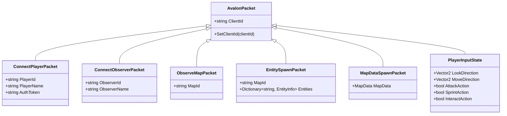
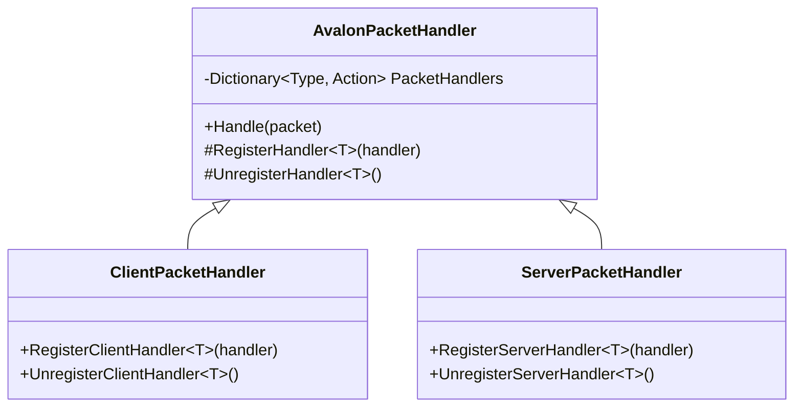
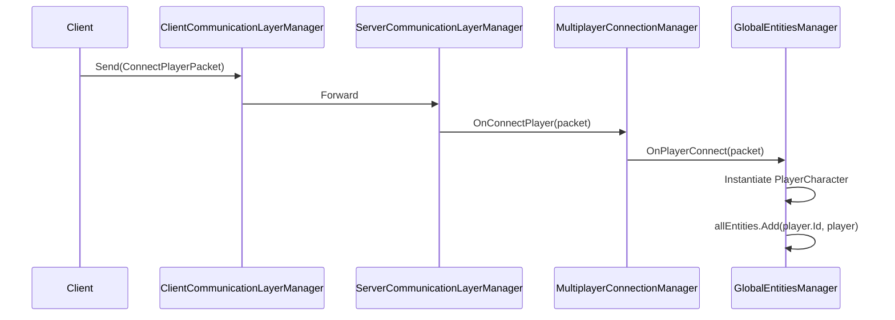
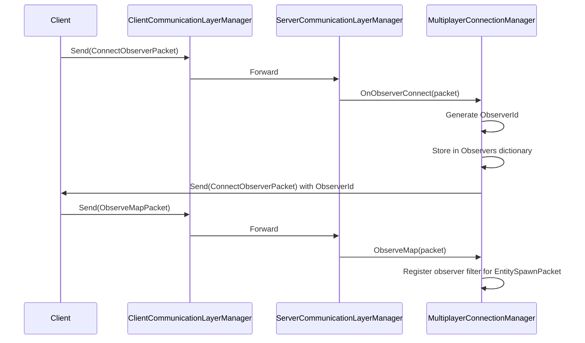
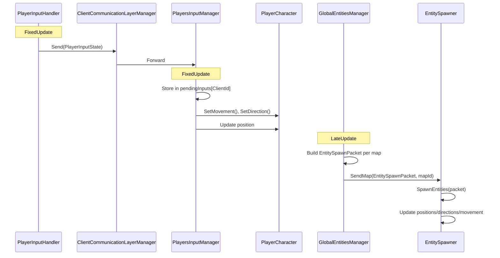

# Packets and Handlers Reference

This document provides a comprehensive reference of all packets and their handlers in the Avalon multiplayer system.

## Packet Class Hierarchy

## Packet Handler Architecture

## Packets Reference

### Base Packet

| Class | File | Description |
|-------|------|-------------|
| `AvalonPacket` | `Assets/Scripts/Multiplayer/Common/AvalonPacket.cs` | Abstract base class for all packets. Contains `ClientId` for routing. |

### Connection Packets

| Packet | Direction | Handler | Description |
|--------|-----------|---------|-------------|
| `ConnectPlayerPacket` | Client -> Server | `MultiplayerConnectionManager.OnConnectPlayer` | Initiates player connection. Contains `PlayerId`, `PlayerName`, `AuthToken`. |
| `ConnectObserverPacket` | Bidirectional | `MultiplayerConnectionManager.OnObserverConnect` | Connects an observer. Server responds with assigned `ObserverId`. |
| `ObserveMapPacket` | Client -> Server | `MultiplayerConnectionManager.ObserveMap` | Subscribes observer to a specific map's entity updates. |

### Entity Packets

| Packet | Direction | Handler | Description |
|--------|-----------|---------|-------------|
| `EntitySpawnPacket` | Server -> Client | `EntitySpawner.SpawnEntities` | Contains all entity states for a map. Broadcast per-map in `LateUpdate`. |
| `MapDataSpawnPacket` | Server -> Client | `MapDataSpawner` (planned) | Contains map terrain/tile data. |

### Input Packets

| Packet | Direction | Handler | Description |
|--------|-----------|---------|-------------|
| `PlayerInputState` | Client -> Server | `PlayersInputManager.HandlePlayerInputState` | Player input (look, move, sprint, interact). Processed once per cycle. |

### Supporting Classes

| Class | File | Description |
|-------|------|-------------|
| `EntityInfo` | `Assets/Scripts/Multiplayer/Common/Packets/EntityInfo.cs` | Entity state data: `EntityType`, `EntityAssetId`, `Position`, `Rotation`, `Movement`. |

## Packet Flow Diagrams

### Player Connection Flow

### Observer Connection Flow

### Input and Entity State Flow

## Handler Registration Summary

### Server-side Handlers

| Handler Class | Packet Type | Registration Location |
|---------------|-------------|----------------------|
| `MultiplayerConnectionManager` | `ConnectPlayerPacket` | `OnEnable()` |
| `MultiplayerConnectionManager` | `ConnectObserverPacket` | `OnEnable()` |
| `MultiplayerConnectionManager` | `ObserveMapPacket` | `OnEnable()` |
| `PlayersInputManager` | `PlayerInputState` | `OnEnable()` |

### Client-side Handlers

| Handler Class | Packet Type | Registration Location |
|---------------|-------------|----------------------|
| `EntitySpawner` | `EntitySpawnPacket` | `OnEnable()` |

## Transport Interfaces

### Client-side

| Interface | Implementation | Description |
|-----------|----------------|-------------|
| `IAvalonClientPacketSender` | `LocalClientPacketSender` | Sends packets from client to server |
| `IAvalonPacketClientReceiver` | (via ClientPacketHandler) | Receives packets from server |

### Server-side

| Interface | Implementation | Description |
|-----------|----------------|-------------|
| `IAvalonPacketServerReceiver` | `LocalServerPacketReceiver` | Receives packets from clients |
| `IAvalonPacketServerSender` | `LocalServerPacketSender` | Sends packets to clients (broadcast or scoped) |

## Adding New Packets

1. Create a new class inheriting from `AvalonPacket` in `Assets/Scripts/Multiplayer/Common/Packets/`
2. Add the `[AvalonAuthorized]` attribute if the packet requires authentication
3. Register a handler on the appropriate side:
   - Server: `serverPacketHandler.RegisterServerHandler<YourPacket>(handler)`
   - Client: `clientPacketHandler.RegisterClientHandler<YourPacket>(handler)`
4. Send the packet via the appropriate communication layer manager
5. Document the packet in this file

## Files of Interest

- `Assets/Scripts/Multiplayer/Common/AvalonPacket.cs` - Base packet class
- `Assets/Scripts/Multiplayer/Common/AvalonPacketHandler.cs` - Handler base class
- `Assets/Scripts/Multiplayer/Client/ClientPacketHandler.cs` - Client handler wrapper
- `Assets/Scripts/Multiplayer/Server/ServerPacketHandler.cs` - Server handler wrapper
- `Assets/Scripts/Multiplayer/Server/MultiplayerConnectionManager.cs` - Connection handlers
- `Assets/Scripts/Multiplayer/Server/PlayersInputManager.cs` - Input processing
- `Assets/Scripts/Character/EntityManagers/EntitySpawner.cs` - Entity state application
