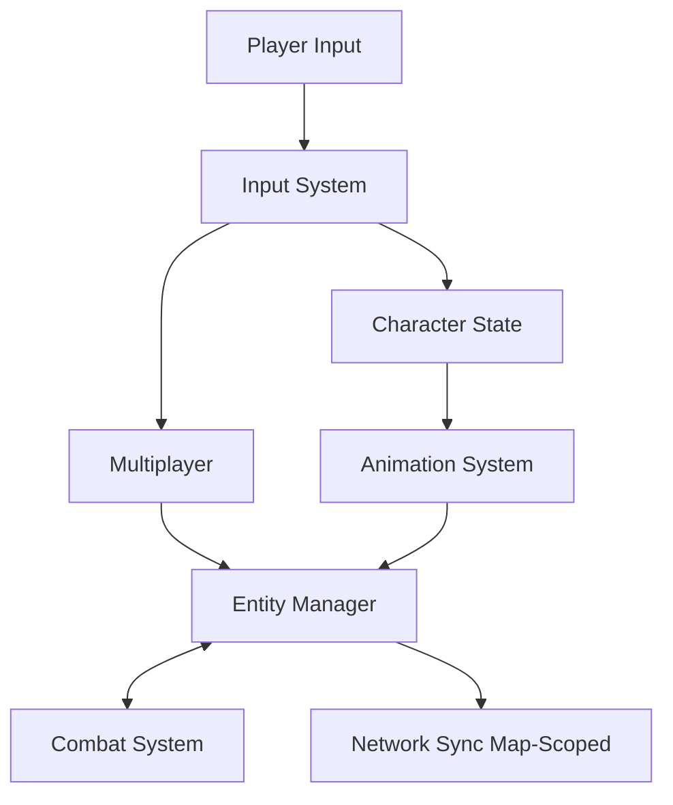

# Architecture Documentation

This directory contains technical architecture documentation for the Avalon MMO prototype. These documents describe the design, structure, and implementation of core systems.

## Architecture Overview

Avalon is built as a Unity-based MMO prototype using:

- **Unity Engine** (Assembly-CSharp, .NET Framework 4.7.1)
- **Client-Server Architecture** with local loopback for testing
- **Event-Driven Systems** for combat, input, and entity management
- **Map-Scoped Design** for efficient multiplayer synchronization

## Core Systems

### [Combat System](combat-system.md)
Lightweight event-driven combat system with tick-based updates.

**Key Components:**
- `CombatManager` - Global combat tick coordinator
- `CombatCharacter` - Base combat entity with stats and health
- `CombatBaseStats` - ScriptableObject for character stats
- Event-based damage resolution

**Status:** Implemented (local/instance-authoritative)

### [Multiplayer Architecture](multiplayer-architecture.md)
Client-server packet handling with observer support and map-scoped delivery.

**Key Components:**
- `ServerCommunicationLayerManager` / `ClientCommunicationLayerManager`
- `ServerPacketHandler` / `ClientPacketHandler`
- Local loopback transport for in-editor testing
- Observer system with map filtering

**Status:** Implemented (local loopback, server input aggregation TODO)

### [Entity Management](entity-management.md)
Centralized entity registration and lifecycle management across maps.

**Key Components:**
- `GlobalEntitiesManager` - Global entity registry
- `PlayerEntitiesManager` - Player-specific queries
- `EntityExtensions` - Utility helpers

**Status:** Implemented (basic functionality)

### [Input System](input-system.md)
Player input capture and distribution with multiplayer synchronization.

**Key Components:**
- `PlayerInputHandler` - Input collection and forwarding
- `PlayerInputMapper` - Input device mapping
- `PlayersInputManager` - Server-side input aggregation (TODO)

**Status:** Implemented (client-side, server aggregation incomplete)

### [Animation System](animation-system.md)
Character animation management with directional support.

**Key Components:**
- `CharacterAnimationHandler` - Animation state coordination
- Directional animation blending (8-way movement)
- Unity Animator integration

**Status:** Implemented (basic, automation in progress)

## System Interactions

## Design Principles

### 1. Event-Driven Architecture
Systems communicate via events to reduce coupling:
- Combat uses events for attack triggers and damage application
- Entity lifecycle uses events for spawn/despawn tracking
- Input can be local or networked without changing consumer code

### 2. Map-Scoped Operations
Entity queries and network packets are scoped by map:
- Reduces search space for spatial queries
- Minimizes network bandwidth (only send to relevant clients)
- Enables independent map simulation

### 3. Client-Server Separation
Clear separation between client and server responsibilities:
- Clients send input, receive authoritative state
- Server validates input, runs simulation, broadcasts results
- Local loopback mode for single-player/testing

### 4. ScriptableObject Configuration
Game data stored in ScriptableObjects:
- Combat stats, enemy behaviors, etc.
- Designer-friendly Unity Inspector editing
- Reusable and composable data assets

## Current Limitations

1. **Combat:** Not yet server-authoritative, local instance resolves combat
2. **Input:** Server-side aggregation (`PlayersInputManager`) unimplemented
3. **Entity Management:** Map transitions need careful handling
4. **Multiplayer:** Local loopback only, no network transport implementation

## Future Architecture Goals

1. **Server-Authoritative Combat**
   - Implement `PlayersInputManager` for input aggregation
   - Move combat resolution to server
   - Implement client-side prediction/interpolation

2. **Network Transport**
   - Replace local loopback with real network transport
   - Add connection management and reconnection
   - Implement bandwidth optimization

3. **Scalability**
   - Spatial partitioning for large maps
   - Entity pooling and recycling
   - Multi-server support for load distribution

4. **Advanced Features**
   - Skill/ability system
   - Inventory and item management
   - Quest and progression systems

## Related Documentation

- [Features Documentation](../features/README.md) - User-facing feature docs
- [Contributing Guide](../contributing/README.md) - How to contribute
- [Documentation Hub](../README.md) - Main documentation index

## File Organization

- `combat-system.md` - Combat architecture details
- `multiplayer-architecture.md` - Network packet flow
- `entity-management.md` - Entity registry and lifecycle
- `input-system.md` - Input handling and synchronization
- `animation-system.md` - Animation coordination

## Getting Started

For developers new to the codebase:

1. Start with [Multiplayer Architecture](multiplayer-architecture.md) to understand the client-server model
2. Read [Entity Management](entity-management.md) to understand how entities are tracked
3. Review [Combat System](combat-system.md) to see event-driven design in practice
4. Check [Input System](input-system.md) for player interaction flow

## Conventions

- All architecture docs use `.md` extension with kebab-case naming
- Each doc includes: Overview, Components, Usage, Limitations, Future Improvements
- Cross-references use relative links within docs
- Code examples included where helpful
- Diagrams use ASCII art for simplicity
