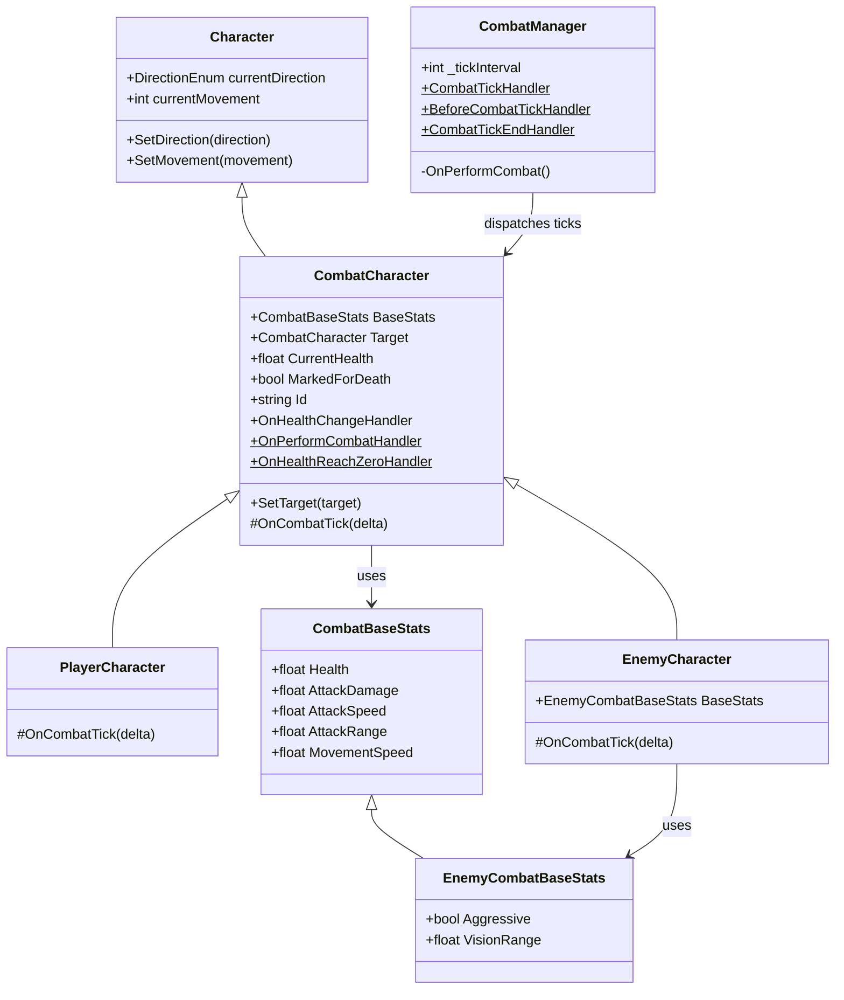
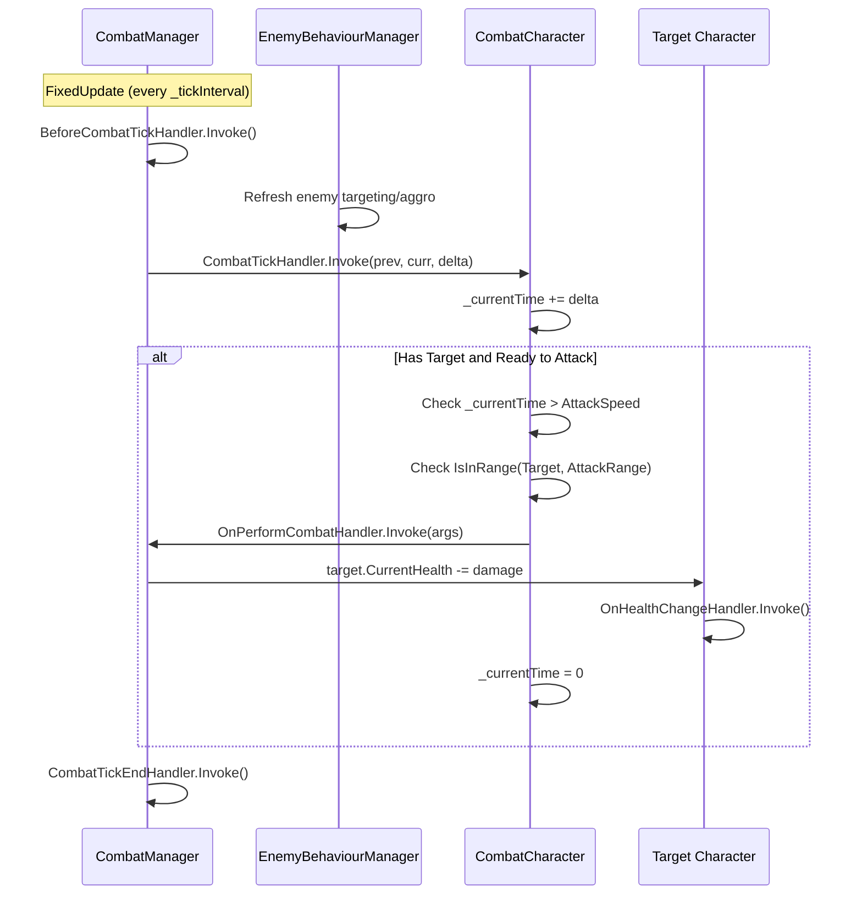

# Combat System

## Overview
- A lightweight combat system implemented for characters.
- Main classes: `CombatManager`, `CombatCharacter`, `CombatBaseStats`, `EnemyCombatBaseStats`, `PlayerCharacter`, `EnemyCharacter`.
- Multiplayer note: combat is presently local/authoritative in-scene. Player input packets (`PlayerInputState`) are routed through the multiplayer layer and processed server-side by `PlayersInputManager`, but combat resolution still happens locally on the instance with a `CombatManager`. Server-authoritative combat is a future goal.

## Combat System Architecture

## Combat Tick Flow

## Components
- `CombatBaseStats` (ScriptableObject)
  - Fields: `Health`, `AttackDamage`, `AttackSpeed`, `AttackRange`, `MovementSpeed`.
  - Create new instances via Unity menu: `Character/Combat Base Stats`.

- `EnemyCombatBaseStats` (inherits `CombatBaseStats`)
  - Adds: `Aggressive`, `VisionRange`.
  - Create via Unity menu: `Character/Enemy Combat Base Stats`.

- `CombatCharacter` (inherits `Character`)
  - Holds a `BaseStats` reference and runtime values: `CurrentHealth`, `_currentTime` and `Target`.
  - Exposes events/delegates:
    - Instance: `OnHealthChangeHandler(HealthChangeEventArgs)` - invoked when `CurrentHealth` changes.
    - Static: `OnPerformCombatHandler(PerformCombatEventArgs)` - invoked when a character performs an attack.
  - Logic:
    - Subscribes to global combat ticks via `CombatManager.CombatTickHandler`.
    - On each tick it accumulates `delta` to `_currentTime` and checks for attack readiness.
    - An attack is performed when `_currentTime > BaseStats.AttackSpeed` and target is in range (`IsInRange`). When an attack happens it invokes `OnPerformCombatHandler` and resets `_currentTime`.
  - Health change triggers a `HealthChangeEventArgs` with `OldHealth`, `NewHealth`, `MaxHealth`.

- `CombatManager` (MonoBehaviour)
  - Manages a global fixed-step combat tick.
  - Configuration: `_tickInterval` (number of FixedUpdate calls between combat ticks).
  - Defines the static event `CombatTickHandler(float previousTickTime, float currentTickTime, float delta)`.
  - Subscribes to `CombatCharacter.OnPerformCombatHandler` to resolve attacks. Current implementation applies damage directly:
    - `target.CurrentHealth -= source.BaseStats.AttackDamage`.
  - Also exposes `BeforeCombatTickHandler` and `CombatTickEndHandler` for pre/post tick hooks.

- `PlayerCharacter` / `EnemyCharacter`
  - `PlayerCharacter` overrides `OnCombatTick` behavior (currently similar to base implementation).
  - `EnemyCharacter` exposes `BaseStats` as `EnemyCombatBaseStats`, draws gizmos for ranges, and moves towards the target when out of range using `MovementSpeed`.

Utilities
- `EntityExtensions.IsInRange<T>(this T source, T target, float range)` - returns whether two characters are within `range` (uses squared magnitude check).
- `EntityExtensions.ClosestTo<T>` - helper to find the closest entity to a position.

Usage
1. Add `CombatManager` as a component to a persistent GameObject in the scene (e.g., `GameManager`).
2. Create `CombatBaseStats` and `EnemyCombatBaseStats` assets via the Create menu and configure values.
3. Assign the appropriate `BaseStats` asset to player and enemy prefabs/components.
4. Set targets for characters at runtime via `SetTarget(CombatCharacter target)`.
5. Subscribe to `OnHealthChangeHandler` on characters to react to health changes (UI, death logic, etc.).

Behavior notes
- Combat ticks are driven by `FixedUpdate` and the `_tickInterval` counter. The `CombatTickHandler` provides the delta between ticks and the tick timestamps.
- Attack timing: `CombatCharacter` accumulates `delta` from ticks and compares to `AttackSpeed`. If over the threshold and within `AttackRange`, an attack is triggered.
- Damage application is currently immediate inside `CombatManager.OnPerformCombat`.
- Tick order per interval: `BeforeCombatTickHandler` -> `CombatTickHandler` -> `CombatTickEndHandler`, executed when `_currentTickIndex >= _tickInterval`.
- Multiplayer flow: Player input is now handled via a client/server split. Clients send `PlayerInputState` via `ClientCommunicationLayerManager`; the server-side `PlayersInputManager` receives, aggregates (one per client per cycle), processes movement/interaction, and echoes the state back for client reconciliation. Combat tick resolution remains local; server-authoritative combat is planned.

TODOs / Known limitations
- No explicit death handling besides clearing the target in `OnHealthReachZero()` - hook animation and removal logic.
- Attack resolution is immediate and simple; consider adding hit/impact animations, projectiles, or attack resolution systems.
- No combat UI or sound behavior wired - subscribe to events to add these features.
- Tick system is simple and tied to `FixedUpdate` frequency. Consider decoupling for deterministic simulations or multiplayer.
- Combat is not yet server-authoritative: combat tick resolution is local. `PlayersInputManager` now handles input aggregation; server-authoritative combat outcomes remain a future goal.

Files of interest
- `Assets/Scripts/Character/Combat/CombatManager.cs`
- `Assets/Scripts/Character/CombatCharacter.cs`
- `Assets/Scripts/Character/Combat/CombatBaseStats.cs`
- `Assets/Scripts/Character/Combat/EnemyCombatBaseStats.cs`
- `Assets/Scripts/Character/Player/PlayerCharacter.cs`
- `Assets/Scripts/Character/Enemy/EnemyCharacter.cs`
- `Assets/Scripts/Character/Extensions/EntityExtensions.cs`

Unstaged / Recent runtime changes included in this update
- Summary: recent unstaged edits introduce the runtime combat tick, attack timing and resolution, and basic damage application. This section lists the concrete code/runtime changes so reviewers and integrators can quickly understand what changed.

Changed files and highlights
- `Assets/Scripts/Character/Combat/CombatManager.cs`
  - Implements a global combat tick driven from `FixedUpdate` with a configurable `_tickInterval` counter.
  - Exposes `public static OnCombatTick CombatTickHandler` invoked periodically with previous/current tick times and delta.
  - Subscribes to `CombatCharacter.OnPerformCombatHandler` and applies damage in `OnPerformCombat` by subtracting `SourceCharacter.BaseStats.AttackDamage` from the target's `CurrentHealth`.
- `Assets/Scripts/Character/CombatCharacter.cs`
  - Subscribes to `CombatManager.CombatTickHandler` in `OnEnable` and accumulates `delta` into `_currentTime` in `HandleCombatTick`.
  - When `_currentTime > BaseStats.AttackSpeed` and target is in range, invokes the static `OnPerformCombatHandler` with `PerformCombatEventArgs` and resets `_currentTime`.
  - Fires `OnHealthChangeHandler` when `CurrentHealth` changes.
  - Adds a debug log in `HandleCombatTick` showing attack timer progression.
- `Assets/Scripts/Character/Player/PlayerCharacter.cs`
  - Initializes `_currentHealth` and `_currentTime` in `Start` and overrides `OnCombatTick` (keeps attack timing behavior compatible with combat ticks).
- `Assets/Scripts/Character/Enemy/EnemyCharacter.cs`
  - Exposes typed `BaseStats` as `EnemyCombatBaseStats` and initializes health/time in `Start`.
  - Draws gizmos for attack/vision ranges and moves toward `Target` in `Update` using `MovementSpeed` when out of attack range.
- `Assets/Scripts/Character/Combat/CombatBaseStats.cs` & `EnemyCombatBaseStats.cs`
  - ScriptableObjects for base stats (health, damage, speed, range, movement) and enemy-specific fields (aggressive, vision range).
- `Assets/Scripts/Character/Extensions/EntityExtensions.cs`
  - `IsInRange` helper uses squared magnitude distance check to determine whether target is within `AttackRange`.

New example assets (untracked)
- `Assets/Scripts/Character/Combat/ExampleInstances/AggressiveOgreBaseStats.asset`
- `Assets/Scripts/Character/Combat/ExampleInstances/PassiveOgreBaseStats.asset`
- Prefabs updated to reference example stats: `Assets/Prefabs/Characters/Enemy_Aggressive.prefab`, `Assets/Prefabs/Characters/Enemy_Passive.prefab`.

Behavioral notes (explicit)
- Attack timing is now driven by the `CombatManager` tick system; `CombatCharacter` accumulates the tick `delta` and performs attacks when the accumulated time exceeds `AttackSpeed`.
- Damage application is immediate and performed in `CombatManager.OnPerformCombat` via direct subtraction from `CurrentHealth`.
- Death handling remains minimal: `OnHealthReachZero()` clears `Target` but does not remove the GameObject or play animations - hook this into your death/cleanup flow.

Testing / QA notes
- To test locally: ensure a `CombatManager` instance is in the scene (attach to a persistent GameObject), assign `BaseStats` to character prefabs, and set `Target` for player/enemy instances. Watch Console for the `[CombatCharacter]` timer logs.
- Verify `FixedUpdate` frequency and `_tickInterval` are appropriate for your gameplay feel; these affect attack cadence granularity.

## Related Documentation

- [Entity Management](entity-management.md) - Entity registry and lifecycle
- [Multiplayer Architecture](multiplayer-architecture.md) - Network packet flow
- [Combat Flow Feature](../features/combat-flow.md) - User-facing combat feature
- [Enemy Behavior](../features/enemy-behavior.md) - Enemy AI targeting
- [Input System](input-system.md) - Input handling and synchronization
