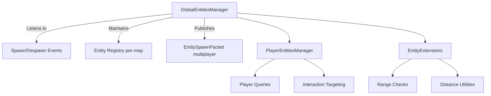

# Entity Management Architecture

## Overview

This document describes the entity management system architecture, which provides centralized entity registration, lifecycle management, and interaction targeting across the game.

## Core Components

### GlobalEntitiesManager

The `GlobalEntitiesManager` serves as the central registry for all entities in the game.

**Responsibilities:**
- Maintains a global registry of entities across all maps
- Listens to spawn/despawn events
- Instantiates players on connect
- When multiplayer is enabled, publishes map-scoped `EntitySpawnPacket` snapshots through `ServerCommunicationLayerManager.SendMap` each `LateUpdate`

**Implementation Details:**
- Subscribes to entity lifecycle events for automatic registration
- Provides per-map entity tracking for efficient spatial queries
- Broadcasts entity state via packet system for multiplayer synchronization

**Location:** `Assets/Scripts/Character/EntityManagers/GlobalEntitiesManager.cs`

### PlayerEntitiesManager

The `PlayerEntitiesManager` provides map-aware helpers for player lookup and interaction targeting.

**Responsibilities:**
- Map-aware player lookup functionality
- Simple interaction targeting (finds nearest enemy on the player's map)
- Player-specific entity queries and utilities

**Implementation Details:**
- Uses map-scoped queries for performance
- Provides convenience methods for common player-entity interactions
- Integrates with combat system for target assignment

**Location:** `Assets/Scripts/Character/Player/PlayerEntitiesManager.cs`

### EntityExtensions

Helper extensions for common entity operations.

**Utilities:**
- Range checks between entities
- Distance calculations
- Entity finding and filtering helpers

**Location:** `Assets/Scripts/Character/Extensions/EntityExtensions.cs`

## Entity Lifecycle

1. **Spawn:** Entity is instantiated and registered with `GlobalEntitiesManager`
2. **Update:** Entity state is maintained and synchronized (multiplayer)
3. **Despawn:** Entity is removed from registry and destroyed

## Map-Scoped Entity Management

Entities are tracked per-map for efficient spatial queries and multiplayer synchronization:

- Each entity is associated with a specific map
- Queries can be scoped to a single map for performance
- Multiplayer packets are filtered by map to reduce bandwidth

## Multiplayer Integration

When multiplayer is enabled:
- `GlobalEntitiesManager` broadcasts entity snapshots via `EntitySpawnPacket`
- Snapshots are scoped per-map using `ServerCommunicationLayerManager.SendMap`
- Only players and observers on the target map receive updates
- Updates occur in `LateUpdate` to ensure state consistency

## Usage

### Initialization

Ensure `GlobalEntitiesManager` and `PlayerEntitiesManager` are initialized at startup:
- Attach to a scene object or bootstrap from code
- `GlobalEntitiesManager` maintains the global registry
- `PlayerEntitiesManager` provides player-specific helpers

### Spawning Entities

Entities are automatically registered when spawned:
```csharp
// Entity spawns trigger registration automatically
// GlobalEntitiesManager listens to spawn events
```

### Querying Entities

Use manager methods for entity queries:
```csharp
// Get players on a specific map
var players = PlayerEntitiesManager.PlayersOnMap(mapName);

// Find nearest entity
var nearest = EntityExtensions.ClosestTo(position, candidates);
```

## Architecture Diagram



## Integration Points

- **Combat System:** Uses entity queries for target selection
- **Input System:** Player input affects entity state
- **Multiplayer System:** Entity state synchronized via packets
- **Enemy Behavior:** Uses entity queries for AI targeting

## Performance Considerations

- Entity queries are scoped by map to reduce search space
- Registry updates happen in batched lifecycle events
- Multiplayer snapshots sent only to relevant observers
- Spatial queries use efficient data structures

## Known Limitations

- Map transitions require careful entity re-registration
- Large numbers of entities on a single map may impact performance
- Current implementation assumes entities belong to exactly one map

## Future Improvements

- Implement spatial partitioning for large maps
- Add entity pooling for frequent spawn/despawn scenarios
- Support entities that span multiple maps (portals, large objects)
- Optimize multiplayer synchronization with delta compression

## Related Documentation

- [Combat System](combat-system.md) - Combat architecture using entity system
- [Multiplayer Architecture](multiplayer-architecture.md) - Packet flow and synchronization
- [Enemy Behavior](../features/enemy-behavior.md) - AI targeting using entity queries
