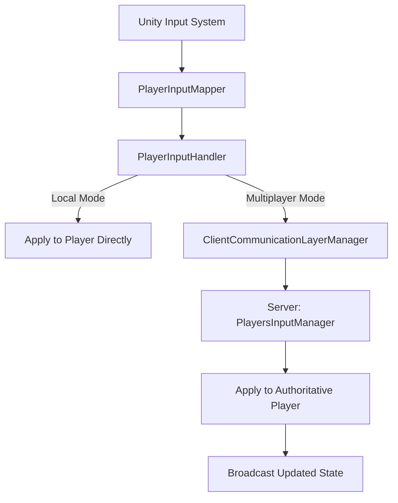

# Input System Architecture

## Overview

The input system handles player input capture, processing, and distribution to gameplay systems. It supports both local and multiplayer modes with client-server input synchronization.

## Core Components

### PlayerInputHandler

The `PlayerInputHandler` is responsible for collecting player input and forwarding it to the appropriate systems.

**Responsibilities:**
- Captures look/move/sprint/interact input each fixed tick
- Packages input into `PlayerInputState` packets
- When multiplayer is enabled, sends input to server via `ClientCommunicationLayerManager`
- When multiplayer is disabled, applies input locally

**Input Processing Flow (Multiplayer):**
1. Collect input from Unity's input system each `FixedUpdate`
2. Package input into `PlayerInputState` packet
3. Send packet to server via `ClientCommunicationLayerManager`
4. Server processes input and returns authoritative state
5. Client applies server-fed state when received

**Input Processing Flow (Local):**
1. Collect input from Unity's input system each `FixedUpdate`
2. Apply state directly to local player character
3. Update player position/state immediately

**Location:** `Assets/Scripts/Input/Handler/PlayerInputHandler.cs`

### PlayerInputMapper

The `PlayerInputMapper` maps raw input events to game actions.

**Responsibilities:**
- Maps keyboard/mouse/gamepad inputs to game actions
- Handles input device detection and switching
- Provides configurable input bindings

**Supported Input Types:**
- Movement (WASD/Arrow keys/Gamepad stick)
- Look direction (Mouse/Gamepad stick)
- Sprint (Shift/Gamepad button)
- Interact (E/Gamepad button)

**Location:** `Assets/Scripts/Input/PlayerInput/PlayerInputMapper.cs`

### PlayersInputManager (Server-Side)

Server-side aggregator for incoming `PlayerInputState` packets from all connected clients.

**Responsibilities:**
- Receives `PlayerInputState` packets from clients via `ServerPacketHandler`
- Stores pending inputs in a dictionary keyed by `ClientId` (one per client per cycle)
- Processes all pending inputs once per `FixedUpdate` cycle
- Applies movement and interaction logic on the server, mutating entity state
- Uses `DirectionEnumHelper` for Vector2 to DirectionEnum conversion

**Current Status:** Implemented

**Location:** `Assets/Scripts/Multiplayer/Server/PlayersInputManager.cs`

## Input State Packet

The `PlayerInputState` packet contains all player input for a single tick:

```csharp
PlayerInputState
{
    Vector2 MoveDirection;
    Vector2 LookDirection;
    bool IsSprinting;
    bool InteractPressed;
    float Timestamp;
}
```

## Input Synchronization

### Local Mode
- Input applied immediately to player
- No network latency
- Direct state updates

### Multiplayer Mode
- Client sends input to server each fixed tick
- Server processes and validates input (TODO)
- Server sends authoritative state back to client
- Client applies server state with interpolation

## Input Pipeline



## Integration Points

- **Character Movement:** Input drives character position and rotation
- **Combat System:** Input triggers attacks and abilities
- **Multiplayer System:** Input synchronized via packet flow
- **Animation System:** Input state affects animation playback

## Known Limitations

- No input buffering or prediction for multiplayer
- No anti-cheat validation on server side
- Input mapped to fixed update tick, may feel less responsive than per-frame

## Future Improvements

- Add client-side prediction for smoother multiplayer feel
- Implement input buffering for combo systems
- Add rebindable controls UI
- Support for multiple input devices simultaneously
- Input replay system for testing and debugging
- Add anti-cheat validation on server side

## TODOs in Code

From `PlayerInputHandler`:
- Extract input helpers into separate modules for clarity
- Replace hardcoded movement speed with configurable character attribute
- Document server tick synchronization strategy

## Related Documentation

- [Multiplayer Architecture](multiplayer-architecture.md) - Packet flow and client-server communication
- [Character Movement](../features/character-movement.md) - Movement feature using input system
- [Combat System](combat-system.md) - Combat integration with input
