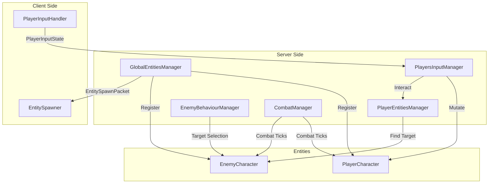
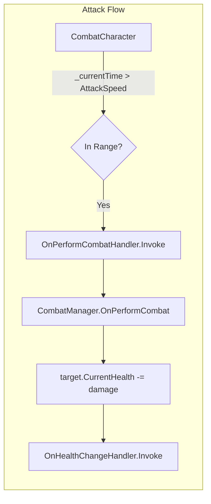

# Feature: Basic Entity Manager and Combat Flow

## Overview

This feature introduces a minimal entity management system, player input
handling, and a simple timed combat flow to bootstrap gameplay
interactions. It centralizes entity operations and provides a starting
point for player/enemy interactions.

## Entity Management Architecture

## Key changes

- `GlobalEntitiesManager`: centralizes entity registration across maps, spawns players on connect, listens for respawn/despawn, and (when multiplayer is enabled) publishes map-scoped `EntitySpawnPacket` snapshots through `ServerCommunicationLayerManager.SendMap` each `LateUpdate`.
- `PlayerEntitiesManager`: map-aware helpers for player lookup and simple interaction targeting (find nearest enemy on the player’s map).
- `EntityExtensions`: helper extensions for common entity operations.
- `PlayerInputHandler`: captures player input and forwards actions to the
  entity system.
- `PlayerCharacter`: initializes runtime health, advances an attack timer
  in `Update`, and triggers timed attacks in `HandleCombat` when a
  `Target` is present.
- `EnemyBehaviourManager` / `EnemyCharacter`: integrate enemies with the
  combat flow; hooks into `CombatManager.BeforeCombatTickHandler` to refresh targeting per tick using map-aware queries.
- `CombatCharacter` / `CombatBaseStats`: shared combat properties and
  base stats used by characters.
- `CombatManager`: a lightweight, event-driven combat coordinator that
  listens for `CombatCharacter` attack events and applies damage to the
  target. It presently applies damage by subtracting
  `SourceCharacter.BaseStats.AttackDamage` from the target's
  `CurrentHealth`.

## Motivation

Having a small, centralized entity manager and clear input and combat
flow makes it easier to iterate on gameplay and prepare for future
extensions (for example, separating combat into a dedicated `Combat
Manager` for multiplayer support).

## Event-driven combat

Combat is implemented with a simple event-based approach:
`CombatCharacter` raises a `OnPerformCombatHandler` event (with
`PerformCombatEventArgs`) when it performs an attack. `CombatManager`
subscribes to this event and applies damage to the target. This keeps
attack initiation (characters and input) separate from damage resolution
(combat manager), which makes it easier to later extend damage
calculation, hit resolution, animations, and network synchronization.

How to use

1. Ensure `GlobalEntitiesManager` and `PlayerEntitiesManager` are initialized at startup (attach to a scene object or bootstrap from code). `GlobalEntitiesManager` maintains the global registry and dispatches map-scoped spawn snapshots in multiplayer.
2. Hook `PlayerInputHandler` up to the input pipeline so player actions
   reach the entity systems.
3. Use `PlayerCharacter` and `EnemyCharacter` prefabs to participate in
   the entity system. The player will perform a timed attack whenever a
   `Target` is set and the attack timer exceeds `BaseStats.AttackSpeed`.
4. Add a `CombatManager` instance to a scene (attach to a GameObject). It
   will automatically subscribe to combat events and apply damage when a
   `CombatCharacter` triggers an attack.

Notes and TODOs

- Current attack action in `PlayerCharacter` logs `Attack` to the
  console and resets the attack timer. Replace with actual attack
  effects (animations, damage application, projectiles, etc.) where
  appropriate.
- `CombatManager.PerformAttack()` is currently a placeholder with no
  direct usage; damage application is handled via the
  `OnPerformCombat` event handler. Consider implementing `PerformAttack()`
  as a public API for programmatic or AI-driven attacks.
- Damage application is currently direct subtraction of
  `AttackDamage` from the target's `CurrentHealth`. Add critical hits,
  armor, resistances, and death handling in future iterations.
- Consider moving combat responsibilities to a dedicated server-side
  system or a more feature-complete `CombatManager` for authoritative
  multiplayer.
- Multiplayer: entity replication is currently a periodic snapshot via `EntitySpawnPacket` (per map) from `GlobalEntitiesManager`. Input aggregation on the server (`PlayersInputManager`) is now implemented; authoritative combat is planned.

Files changed

- `Assets/Scripts/Character/Extensions/EntityExtensions.cs`
- `Assets/Scripts/Character/EntityManagers/GlobalEntitiesManager.cs`
- `Assets/Scripts/Character/Player/PlayerEntitiesManager.cs`
- `Assets/Scripts/Character/Player/PlayerCharacter.cs`
- `Assets/Scripts/Input/Handler/PlayerInputHandler.cs`
- `Assets/Scripts/Character/Enemy/EnemyBehaviourManager.cs`
- `Assets/Scripts/Character/Enemy/EnemyCharacter.cs`
- `Assets/Scripts/Character/CombatCharacter.cs`
- `Assets/Scripts/Character/Combat/CombatBaseStats.cs`
- `Assets/Scripts/Character/Combat/CombatManager.cs` (lightweight
  event-driven damage resolver)
- `Assets/Scripts/Character/UI/HealthBar.cs` (UI binding for character
  health)

See also

- `docs/index.md` for a list of documentation pages for this repository.
- `docs/CombatSystem.md` — implementation reference and usage notes for the combat subsystem.
